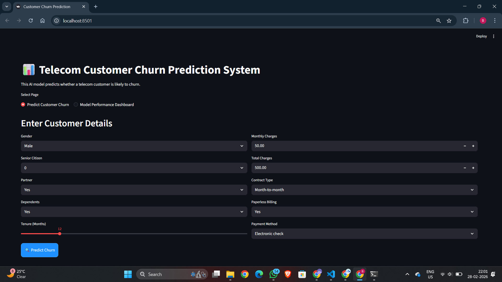
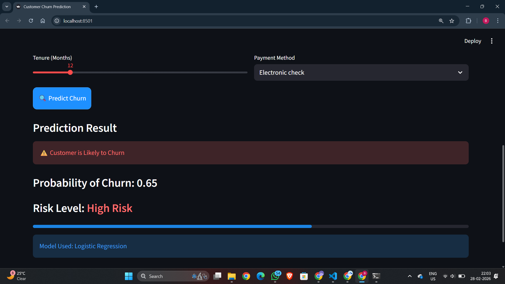

# 📊 Customer Churn Prediction Model

## 📌 Project Overview

This project implements a **Customer Churn Prediction Model** using Machine Learning techniques.  
The objective is to predict whether a customer is likely to discontinue a service based on historical data.

Customer churn prediction enables businesses to proactively identify at-risk customers and take preventive measures to improve retention and reduce revenue loss.

---

## 🎯 Problem Statement

Customer churn refers to customers who stop using a company's product or service within a given period.

High churn rates can:
- Reduce revenue
- Increase customer acquisition costs
- Affect long-term business growth

This project aims to:
- Analyze customer data
- Identify churn patterns
- Build a predictive classification model
- Evaluate performance using standard ML metrics

---

## 📊 Dataset Description

The dataset contains:

- Customer demographics
- Subscription details
- Service usage information
- Billing and payment details
- Churn status (Target Variable)

### Target Variable:
- `0` → Customer Retained  
- `1` → Customer Churned  

---

## ⚙️ Machine Learning Workflow

### 1️⃣ Data Preprocessing
- Handling missing values
- Encoding categorical features
- Feature scaling

### 2️⃣ Exploratory Data Analysis (EDA)
- Data visualization
- Correlation analysis
- Class imbalance analysis

### 3️⃣ Model Building
Algorithm used includes:
- Logistic Regression

### 4️⃣ Model Evaluation
Metrics used:
- Accuracy
- Precision
- Recall
- F1-Score
- Confusion Matrix

> Note: Recall is particularly important in churn prediction to correctly identify customers who are likely to leave.

---

## 🖥 Application Screenshots

The following screenshots demonstrate the working interface of the Customer Churn Prediction System, including the input form and prediction output.

### 🔹 Customer Input Interface

This screen allows users to enter customer demographic details, subscription information, billing data, and contract details required for churn prediction.



---

### 🔹 Prediction Result Output

After submitting customer details, the system predicts whether the customer is likely to churn.  
It also displays the probability score and risk level using a Logistic Regression model.



---

## 🚀 How to Run the Project

### 1️⃣ Clone the Repository

```bash
git clone https://github.com/your-username/customer-churn-prediction.git
```

Open the Jupyter Notebook:

```bash
jupyter notebook notebooks/churn_analysis.ipynb
```

---

## 🛠 Technologies Used

- Python
- Pandas
- NumPy
- Scikit-learn
- Matplotlib
- Seaborn
- Jupyter Notebook

---

## 📈 Business Impact

Using churn prediction, businesses can:

- Identify high-risk customers
- Offer targeted retention strategies
- Improve customer satisfaction
- Reduce revenue loss
- Increase customer lifetime value

This approach transforms churn handling from reactive to proactive.

---

## 📌 Future Enhancements

- Hyperparameter tuning
- Handling class imbalance using SMOTE
- Model deployment using Flask or FastAPI
- Real-time prediction API
- Interactive dashboard integration

---

## 📜 License

This project is open-source and available under the MIT License.
